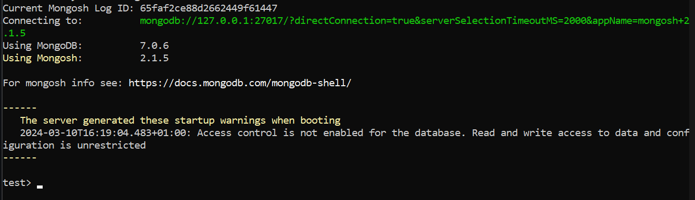

# ¿Es MongoDB una base de datos SQL o NoSQL?

## ¿Que son las bases de datos SQL?

Una base de datos SQL es una base de datos relacional, escrita en el lenguaje de consulta estructurado SQL, que es el acrónimo de Structured Quey Langage.

Las bases de datos SQL tiene una estructura de tabla (similar a Excel) que consta de columnas y filas.

Tienen herramientas para evitar la duplicidad de registros, y al llevar mucho tiempo en el mercado tienen mayor soporte.

Además, dispone de un sistema estándar  (SQL) para las operaciones con la base de datos, como inserción, actualización o consultas.

## ¿Qué son las bases de datos NoSQL?

Una base de datos No SQL es una base de datos no relacional que no cuenta con un identificador que relacione un conjunto de datos con otro. En las bases de datos No SQL la información es organizada generalmente como documentos y no requieren que los datos están estructurados para poder manipularlos.

Las bases de datos NoSQL son más versátiles y las opciones open source no requieren pago de licencia.

Además, permiten guardar datos de cualquier tipo sin requerir una verificación, y realizan consultas utilizando lelnguaje JSON (JavaScript Object Notation).

## Diferencias entre SQL y NoSQL

Las bases de datos NoSQL ofrecen mayor rendimiento que las SQL, ya que necesitan menos recursos de hardware.

Las bases de datos relacionales SQL son más fiables que las NoSQL, porque si un proceso tiene algún error no se lleva a cabo.

En cuanto a la consistencia, o la capacidad de garantizar la integridad de los datos, es pobre en las bases de datos NoSQL. Las SQL son sin embargo muy consistentes.

Con respecto al volumen de almacenamiento, las bases de datos SQL son indicadas para una cantidad de datos no muy grande. Las NoSQL pueden manejar grandes volúmenes de datos.

Por otro lado, las NoSQL son escalables porque se puede aumentar su capacidad fácilmente. Las SQL pueden serlo pero con un costo económico más elevado. Las bases de datos No SQL utilizan un escalado horizontal (aumentar el número de servidores) mientras que las SQL utilizan un escalado vertical (aumentar los recursos de un servidor).

## ¿Cuándo utilizar una u otra opción?

La decisión de utilizar bases de datos SQL o NoSQL dependerá de los requisitos de la aplicación. Como norma general:&#x20;

* Si tienes datos que dependen en gran medida de las relaciones, entonces es probable que la mejor opción sea utilizar una base de datos relacional SQL.&#x20;
* Si tienes un conjunto de datos no estructurados que necesitan flexibilidad, entonces la mejor opción será optar por una base de datos NoSQL.

## Ejemplos de bases de datos SQL

Estas son algunas de las bases de datos SQL más conocidas:

* MySQL:principal gestor de bases de datos en SQL. Es una herramienta open source en código abierto.&#x20;
* Oracle: una de las herramientas más potentes del mercado, destinada principalmente a medianas o grandes empresas.&#x20;
* Microsoft Access: herramienta de Microsoft para la creación de bases de datos SQL&#x20;
* SQLite: es una biblioteca de C que provee una base de datos ligera basada en disco que no requiere un proceso de servidor separado y permite acceder a la base de datos usando una variación no estándar del lenguaje de consulta SQL

## Ejemplos de bases de datos NoSQL

Algunas de las bases de datos NoSQL más reconocidas son las siguientes:&#x20;

* ApacheCassandra: es una base de datos de tipo clave-valor. Está diseñada para almacenar grandes cantidades de datos y realizar distribuciones a través de varios nodos.
* CouchDB: su fuerte es la accesibilidad y compatibilidad web con diferentes tipos de dispositivos.
* Redis: su diseño principal está basado en el almacenamiento de tablas de hashes aunque no es restrictiva sólo hacia este modelo. También tiene la posibilidad de ser utilizada como una BBDD persistente.&#x20;
* MongoDB: importante gestor de datos que almacena documentos en un formato parecido al JSON a alta velocidad. Es ideal para proyectos en los que se requiera alto nivel de escalabilidad. Le dedicaremos el siguiente apartado.

## MongoDB

### ¿Qué es MongoDB?

MongoDB es una base de datos NoSQL que ofrece una gran escalabilidad y flexibilidad, y un modelo de consultas e indexación avanzado.

Esta base de datos almacena datos en documentos flexibles similares a JSON, por lo que los campos pueden variar entre documentos y la estructura de datos puede cambiarse con el tiempo.

Es una base de datos distribuida en su núcleo, por lo que la alta disponibilidad, la escalabilidad horizontal y la distribución geográfica están integradas y son fáciles de usar.

MongoDB es de uso gratuito. Las versiones lanzadas antes del 16 de octubre de 2018 se publican bajo licencia AGPL. Todas las versiones posteriores al 16 de octubre de 2018, incluidos los parches lanzados para versiones anteriores, se publican bajo Licencia pública del lado del servidor (SSPL) v1.

### Instalación

La descarga e instalación de MongoDB dependerá del sistema operativo que utilices, por lo que puedes acceder al siguiente link y seguir las indicaciones que apliquen para tu caso:

https://www.mongodb.com/docs/manual/installation/

Además, deberás escoger entre instalar MongoDB Community edition y MongoDB Enterprise.

¿En qué se diferencian las licencias MongoDB Community y Enterprise? MongoDB Community es la edición gratuita de MongoDB, mientras que MongoDB Enterprise solo está disponible con la suscripción MongoDB Enterprise Advanced e incluye un completo soporte para sus despliegues en MongoDB.

#### MongoDB Shell, mongosh

Mongo shell es una interfaz JavaScript interactiva para MongoDB. Puedes utilizar mongo shell para consultar y actualizar datos, así como para realizar operaciones administrativas.

MongoDB Shell (mongosh) no se instala con MongoDB Server, por lo tanto deberás seguir las instrucciones el siguiente enlace para descargar e instalar mongosh por separado:



### Primeros pasos con MongoDB

Para acceder a MongoDB, primero debemos tener el Daemon de MongoDB ejecutándose.

Para ello, es necesario que en nuestra línea de comando nos movamos al directorio que contenga el archivo "mongod".

```
cd “C:\Program Files\MongoDB\Server\7.0\bin”
```

Este es el directorio en mi caso, pero dependerá de la ubicación de la instalación.

A continuación deberemos introducir el comando:

```
mongod
```

Ahora abrir una nueva pestaña de cmd sin cerrar la anterior, e introducir:

```
mongosh
```

Este debería ser el aspecto de tu terminal:

<figure><figcaption></figcaption></figure>

Ahora que lo tenemos, veamos algunas operaciones sencillas y su output.

Dado que el código introducido para determinadas acciones puede ser largo, es común escribir el código en un editor de texto para que sea más cómodo, y a continuación pegarlo en el shell.

Para ver las bases de datos que tenemos en el sistema:

```
show dbs
```

<figure><figcaption></figcaption></figure>

Crear nueva base de datos o acceder a una existente:

```
use nombreBaseDatos
```

<figure><figcaption></figcaption></figure>

Crear nuevo usuario:

```javascript
db.createUser({
    user: 'leslieknope',
    pwd: 'waffles',
    customData: { startDate: new Date() },
    roles: [
      { role: 'clusterAdmin', db: 'admin' },
      { role: 'readAnyDatabase', db: 'admin' },
      'readWrite'
    ]
  })
```

<figure><figcaption></figcaption></figure>

Ver todos los usuarios de la base de datos:

```javascript
  db.getUsers()
```

Eliminar un usuario:

```javascript
  db.dropUser('leslieknope')
```

Crear una colección (es la forma de organizar la base de datos. Las colecciones almacenan documentos, que son los elementos a introducir en la base de datos).

```javascript
db.createCollection('movies')
```

<figure><figcaption></figcaption></figure>

Ver colecciones:

```javascript
show collections
```

Insertar un documento en la base de datos:

```javascript
  db.movies.insertOne({
    "title": "The princess bride",
    "year": 1987,
    "reviews": [
      {1: "Magical movie"},
      {2: "So boring"}
    ]
  })
```

&#x20;La función insertOne() espera un objeto.&#x20;

Recuerda que al tratarse de una BBDD NoSQL cada elemento puede tener la estructura que tú elijas. Ejemplo de otro documento con una estructura diferente:

```javascript
db.movies.insertOne({
  "title": "The Bob's Burgers movie",
  "year": 2022,
  "directors": [
    {"name": "Loren Bouchard"},
    {"name": "Bernard Derriman"}
  ],
  "reviews": 99,
  "cast": [
    {"Tina": "Dan Mintz"},
    {"Gene": "Eugene Mirman"},
    {"Louise": "Kristen Schaal"}
  ]
})
```

<figure><figcaption></figcaption></figure>

<figure><figcaption></figcaption></figure>


Sin embargo, Intenta ser lo más consistente posible para que tu base de datos sea utilizable.&#x20;

Asimismo, si cometemos algún error de sintaxis MongoDB nos lo notificará.

<figure><figcaption></figcaption></figure>

Insertar varios documentos:

```javascript
  db.movies.insertMany([
    {
      "title": "Life of Brian",
      "year": 1979,
    },
    {
      "title": "Mapa de los sonidos de Tokio",
      "director": "Isabel Coixet",
    },
    {
      "title": "Everything Everywhere All at Once",
    }
  ])
```

<figure><figcaption></figcaption></figure>

Consultar todos los documentos:

```javascript
db.movies.find()
```

<figure><figcaption></figcaption></figure>

Consultar documentos específicos:

```javascript
  db.movies.find( {title: "The princess bride"} )
```

```javascript
  db.movies.find( {year: 2022} )
```

Si hay varias coincidencias, MongoDB devolverá todas. Existe una función para que solo nos devuelva un resultado:

```javascript
db.movies.findOne({ year: 2022 })
```

Si MongoDB no encuentra ningún resultado, no devolverá nada, tampoco un mensaje de error.

En relación a las búsquedas, debemos mencionar de que se considera una mala práctica realizar una búsqueda que nos devuelva todos los atributos de los elementos, ya que normalmente querremos escoger qué atributos queremos ver.

Para esto existen las proyecctiones, que son limitaciones que ponemos a nuestra búsqueda para que nos devuelva la información que escojamos. La sintaxis consiste en añadir un segundo objeto a la función find, en la que con 0s y 1s escogeremos qué atributos queremos.

```javascript
  db.movies.find(
    {
      title: "The princess bride"
    },
    {
      _id: 0,
      title: 1,
      year: 1
    }
  )
```

El atributo \_id se nos devolverá por defecto, así que si no lo queremos deberemos explícitamente asignarle el número 0.

<figure><figcaption></figcaption></figure>

Eliminar un documento:

```javascript
db.movies.deleteOne({title: "Mapa de los sonidos de Tokio"})
```

<figure><figcaption></figcaption></figure>

Podemos utilizar la función deleteMany() para eliminar todos los documentos que cumplan con el criterio establecido. Por ejemplo, para borrar todas  las películas del 2022:

```
db.movies.deleteMany(year: 2022})
```

#### Otros conceptos a explorar

A continuación mencionaremos otras funcionalidades de MongoDB para que puedas investigar y probar en tu base de datos particular:

* Función $slice
* Búsqueda de elementos anidados
* Función $exists
* Uso de regular expressions

## Fuentes

Agradecimientos a:

* https://www.mongodb.com/es/nosql-explained&#x20;
* https://ayudaleyprotecciondatos.es/bases-de-datos/sql/&#x20;
* https://www.mongodb.com/docs/manual/?\_ga=2.128054348.1193247927.1710508974-1202821968.1710082371&#x20;
* https://www.purestorage.com/es/knowledge/what-is-mongodb.html#:\~:text=MongoDB%20es%20muy%20flexible%20y,bases%20de%20datos%20relacionales%20tradicionales.
* &#x20;https://ilimit.com/blog/base-de-datos-sql-nosql/#que-es-una-base-de-datos-sql&#x20;
* https://www.grapheverywhere.com/bases-de-datos-nosql-marcas-tipos-ventajas/
